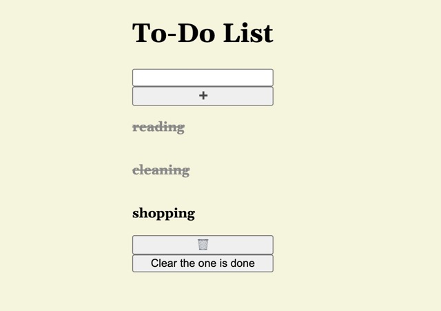
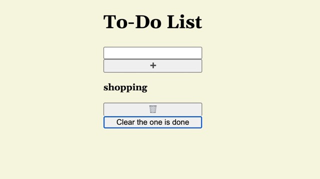

# To Do List
A lightweight to-do list that lets you add tasks, mark them as done, and clear them out。

- Full Website: https://todo-list-rc-alpha.vercel.app/
- This is how it looks like:




## How it is made:
#### Tech Used:HTML,CSS and JavaScript
## Why this stack is chosen:
- Choosign these stack because they can run natively in every browser without requiring complex environment.

## Getting Started

1. Clone this repository
```bash
   git clone https://github.com/sabrinalindev/todo-list.git
```
2. Open `index.html` in your browser

## How to Use

1. **Add a task** — type your task and add it to the list
2. **Complete a task** — click on a task to mark it done (it'll show with a strikethrough)
3. **Clear completed tasks** — remove finished tasks from the list
4. **Clear all** — wipe the entire list clean and start fresh

## Features

- Add new tasks
- Click to mark a task complete (strikethrough style)
- Clear only completed tasks
- Clear the entire list

## Optimizations

- Add local storage so tasks persist even after refreshing the page
- Add task categories or priority levels to help organize larger to-do lists

